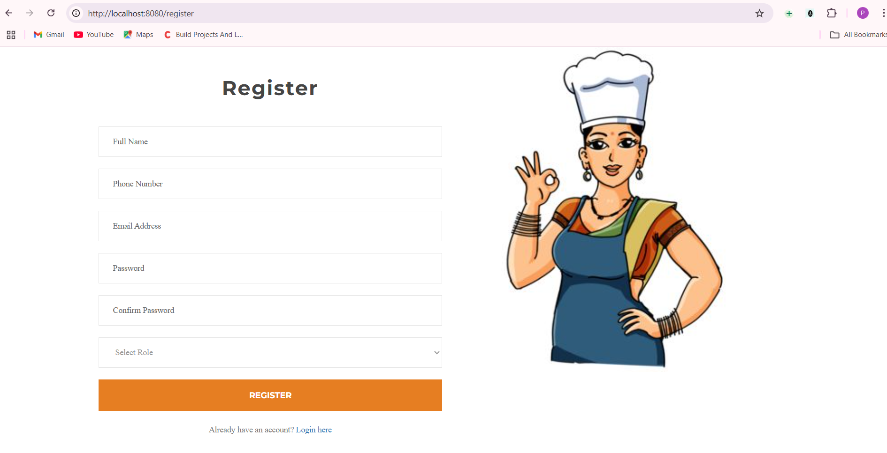
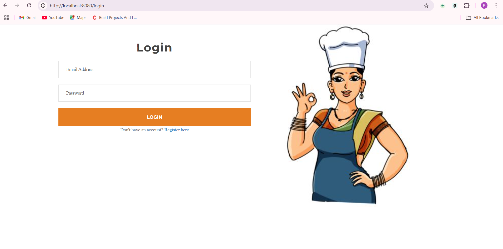
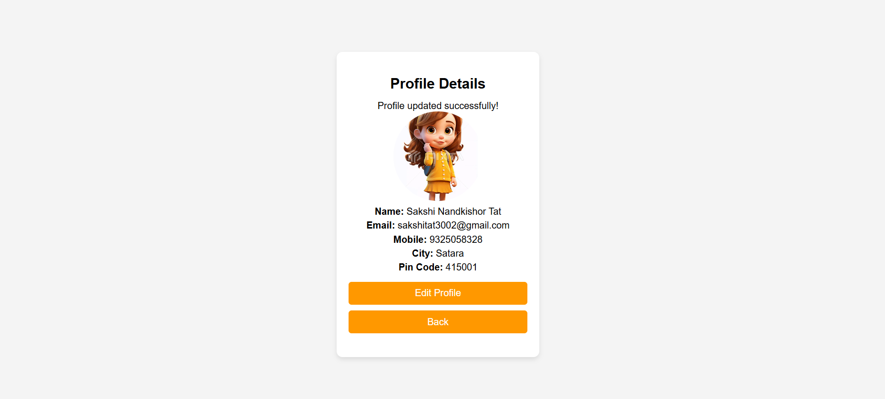
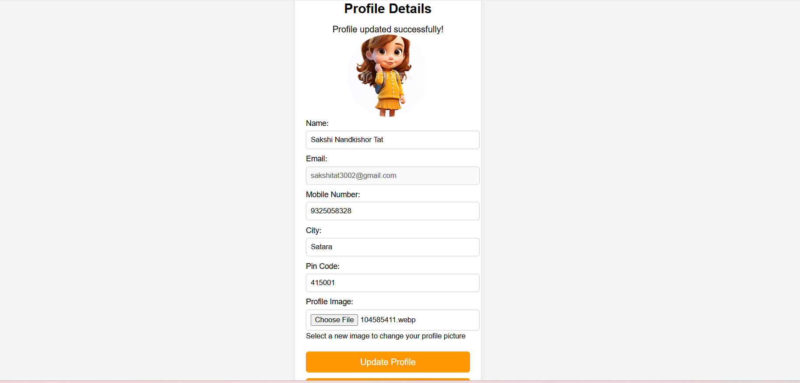
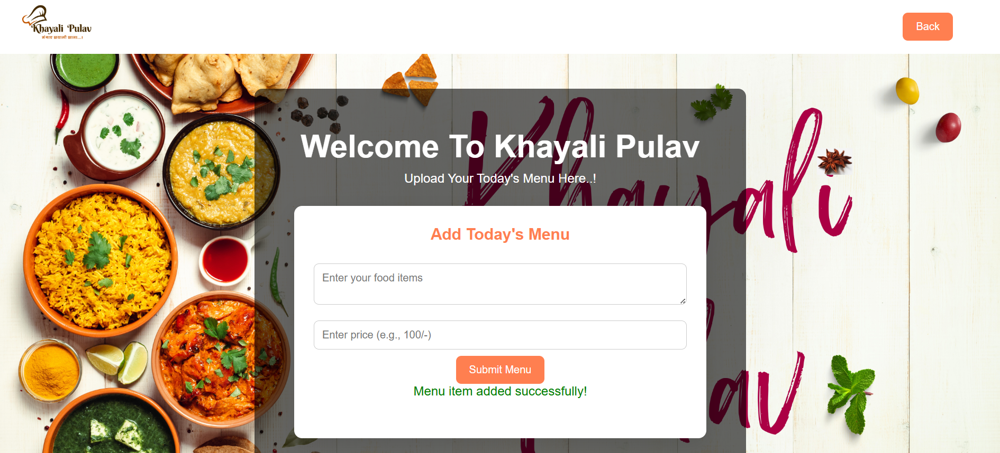
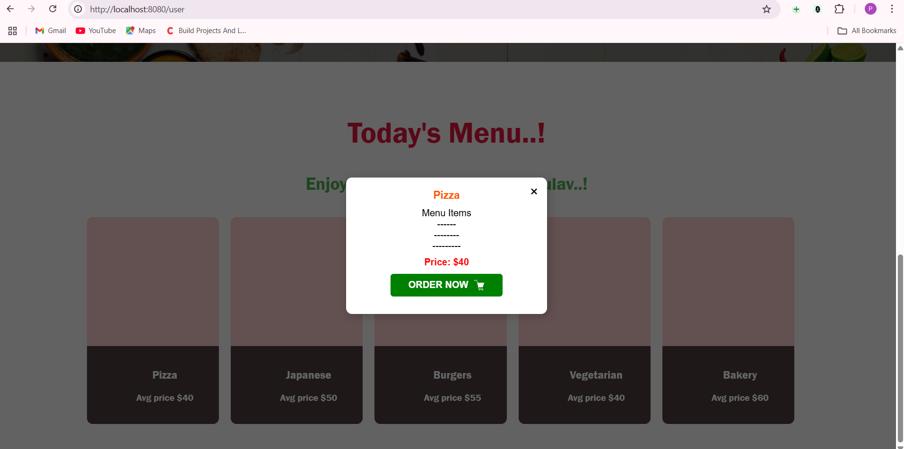
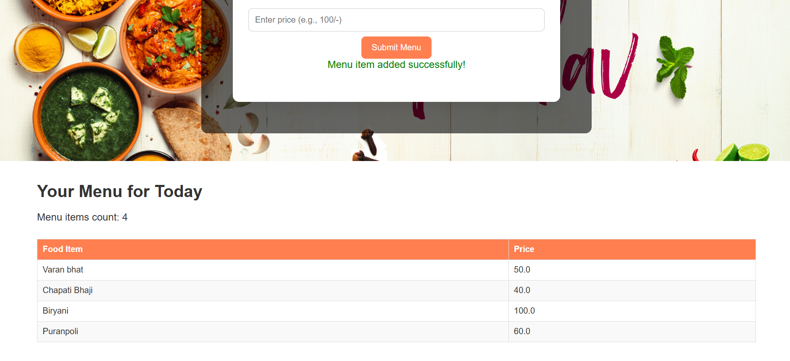
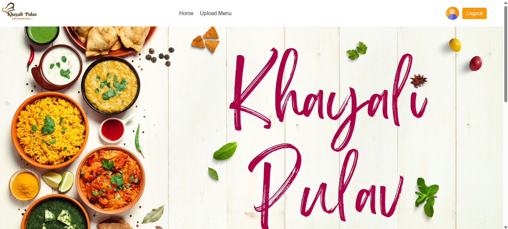
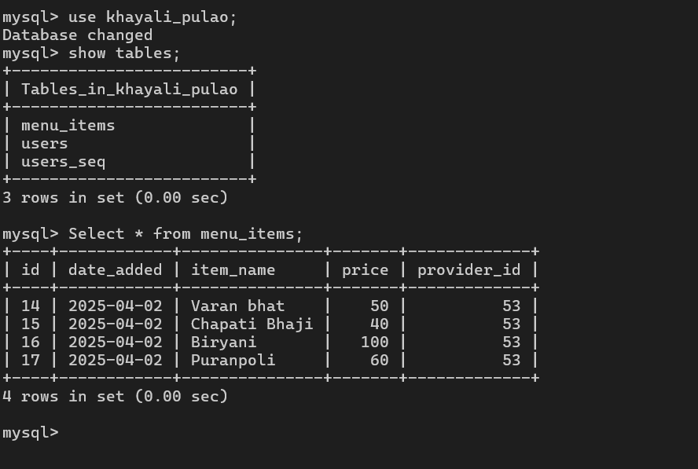

#### Khayali Pulav 
Description : 

Khayali Pulav is a geolocation-based platform connecting users with nearby home-cooked meal providers.
It offers affordable, healthy meals while empowering home chefs to earn. The platform ensures a seamless
experience for meal discovery, ordering, and delivery.

## Khayali Pulav Project Screenshots

### Registration Page

### Login Page

### Profile Page

### Update Profile

### Upload Menu

### Today's Menu

### Menu of Provider

### Provider Homepage

### Menu_items_table

### Users_table_with_images

